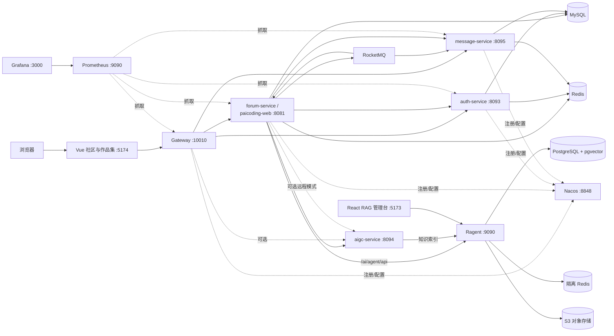

# 架构曲线验证

此样例按参考图的结构重建，用于检查复杂关系中的平滑曲线。

```mermaid
flowchart LR
 B[浏览器] --> V[Vue 社区与作品集 :5174]
 V --> G[Gateway :10010]
 G --> F[forum-service /<br/>paicoding-web :8081]
 G --> A[auth-service :8093]
 G --> M[message-service :8095]
 F --> Q[RocketMQ]
 Q --> F
 Q --> M
 F --> A
 F --> M
 F --> DB[(MySQL)]
 F --> C[(Redis)]
 A --> DB
 A --> C
 M --> DB
 M --> C
 F --> AI[aigc-service :8094]
 G -. 可选 .-> AI
 F -. 可选远程模式 .-> AI
 F -->|/ai/agent/api| R[Ragent :9090]
 AI -->|知识索引| R
 UI[React RAG 管理台 :5173] --> R
 R --> PG[(PostgreSQL + pgvector)]
 R --> RC[(隔离 Redis)]
 R --> S3[(S3 对象存储)]
 GR[Grafana :3000] --> P[Prometheus :9090]
 P -. 抓取 .-> G
 P -. 抓取 .-> F
 P -. 抓取 .-> A
 P -. 抓取 .-> M
 G -. 注册/配置 .-> N[Nacos :8848]
 F -. 注册/配置 .-> N
 A -. 注册/配置 .-> N
 M -. 注册/配置 .-> N
```
